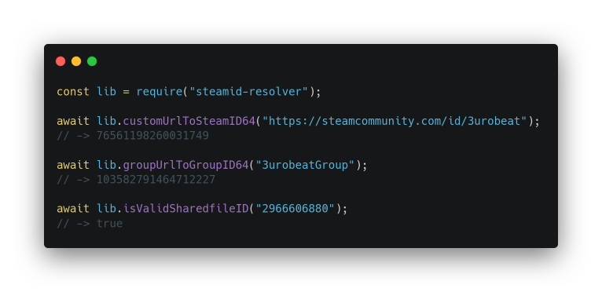

<div align="center">
    <h1>steamid-resolver</h1>
    <h4>A node.js library to easily convert and check Steam Links & IDs!</h4>
    <div>
        <a href="#features">Features</a> •
        <a href="#install">Install</a> •
        <a href="#functions">Functions</a>
    </div>
    <p></p>
    <div>
        <a href="https://github.com/3urobeat/node-steamid-resolver/blob/master/LICENSE"></a>
        <a href="https://npmjs.com/package/steamid-resolver"></a>
        <a href="https://github.com/3urobeat/node-steamid-resolver"></a>
        <a href="https://npmjs.com/package/steamid-resolver"></a>
        <a href="https://github.com/sponsors/3urobeat"></a>
    </div>
    
</div>

## Features
Convert:
- ...profile URL or vanity to steamID64
- ...group URL or Custom URL to groupID64
- ...steamID64 to profile vanity
- ...validate sharedfile (screenshots, artworks & guides) IDs

It can also return you all information Steam knows [about a profile](https://steamcommunity.com/id/3urobeat?xml=1) in a nice object format.  

&nbsp;

## Install
Open a terminal in your project folder and run:  
\> `npm install steamid-resolver`

Do not use the scoped *GitHub Packages* command, it will not work.

You can then import the library in your project:  
```js
const steamIdResolver = require("steamid-resolver");
```  

&nbsp;

## Functions  
All functions support both Promises and callbacks!  
This means you can either use `await`, `.then(response => {})` & `.catch(err => {})` or pass a callback function `(err, response) => {}` as parameter.  
Note: You cannot use both callbacks and `.catch()` as a Promise is only rejected when no callback was passed. This prevents any `UnhandledPromiseRejection` errors crashing your process.  

&nbsp;

### steamID64ToCustomUrl(steamID64, callback)  
- `steamID64` - steamID64 or full URL of the user you want to get the customURL of. Example: `"76561198260031749"` or `"https://steamcommunity.com/profiles/76561198260031749"`  
- `callback` - Optional: Called on error or success  
    - `err` - A String detailing the reason of the failure or `null` on success
    - `customURL` - The customURL of the user or `null` on failure. Example on success: `"3urobeat"`  

### customUrlToSteamID64(customURL, callback)  
- `customURL` - customURL or full URL of the user you want to get the steamID64 of. Example: `"3urobeat"` or `"https://steamcommunity.com/id/3urobeat"`  
- `callback` - Optional: Called on error or success  
    - `err` - A String detailing the reason of the failure or `null` on success
    - `steamID64` - The steamID64 of the user or `null` on failure. Example on success: `"76561198260031749"`  

### steamID64ToFullInfo(steamID64, callback)  
- `steamID64` - steamID64 or full URL of the user you want to get all information of.  
- `callback` - Optional: Called on error or success  
    - `err` - A String detailing the reason of the failure or `null` on success
    - `info` - The full information of the user as object or `null` on failure. Example: [Imagine this but as an object](https://steamcommunity.com/id/3urobeat?xml=1)  

### steamID64ToProfileName(steamID64, callback)
- `steamID64` - steamID64 or full URL of the user you want to get the profile name of. Example: `"76561197960287930"` or `"https://steamcommunity.com/profiles/76561197960287930"`  
- `callback` - Optional: Called on error or success  
    - `err` - A String detailing the reason of the failure or `null` on success
    - `profileName` - The profile name of the user or `null` on failure. Example on success: `"Rabscuttle"`  

### customUrlToFullInfo(customURL, callback)  
- `customURL` - customURL or full URL of the user you want to get all information of.  
- `callback` - Optional: Called on error or success  
    - `err` - A String detailing the reason of the failure or `null` on success
    - `info` - The full information of the user as object or `null` on failure. Example: [Imagine this but as an object](https://steamcommunity.com/id/3urobeat?xml=1) 

### customUrlToProfileName(customURL, callback)
- `customURL` - customURL or full URL of the user you want to get the profile name of. Example: `"gabelogannewell"` or `"https://steamcommunity.com/id/gabelogannewell"`  
- `callback` - Optional: Called on error or success  
    - `err` - A String detailing the reason of the failure or `null` on success
    - `profileName` - The profile name of the user or `null` on failure. Example on success: `"Rabscuttle"`  

### groupUrlToGroupID64(groupURL, callback)  
- `groupURL` - groupURL or full URL of the group you want to get the groupID64 of. Example: `"3urobeatGroup"` or `"https://steamcommunity.com/groups/3urobeatGroup"`  
- `callback` - Optional: Called on error or success  
    - `err` - A String detailing the reason of the failure or `null` on success
    - `groupID64` - The groupID64 of the group or `null` on failure. Example on success: `"103582791464712227"`  

### groupUrlToFullInfo(groupURL, callback)  
- `groupURL` - groupURL or full URL of the group you want to get all information of.  
- `callback` - Optional: Called on error or success  
    - `err` - A String detailing the reason of the failure or `null` on success
    - `info` - The full information of the group as object or `null` on failure. Example: [Imagine this but as an object](https://steamcommunity.com/groups/3urobeatGroup/memberslistxml?xml=1) 

### isValidSharedfileID(sharedfileID, callback)  
- `sharedfileID` - Sharedfile ID or full sharedfile URL. Example: `"2966606880"` or `"https://steamcommunity.com/sharedfiles/filedetails/?id=2966606880"`
- `callback` - Optional: Called on error or success
    - `err` - A string detailing the reason of the failure or `null` on success
    - `isValid` - `true` if a sharedfile with that ID exists or `false` if not
